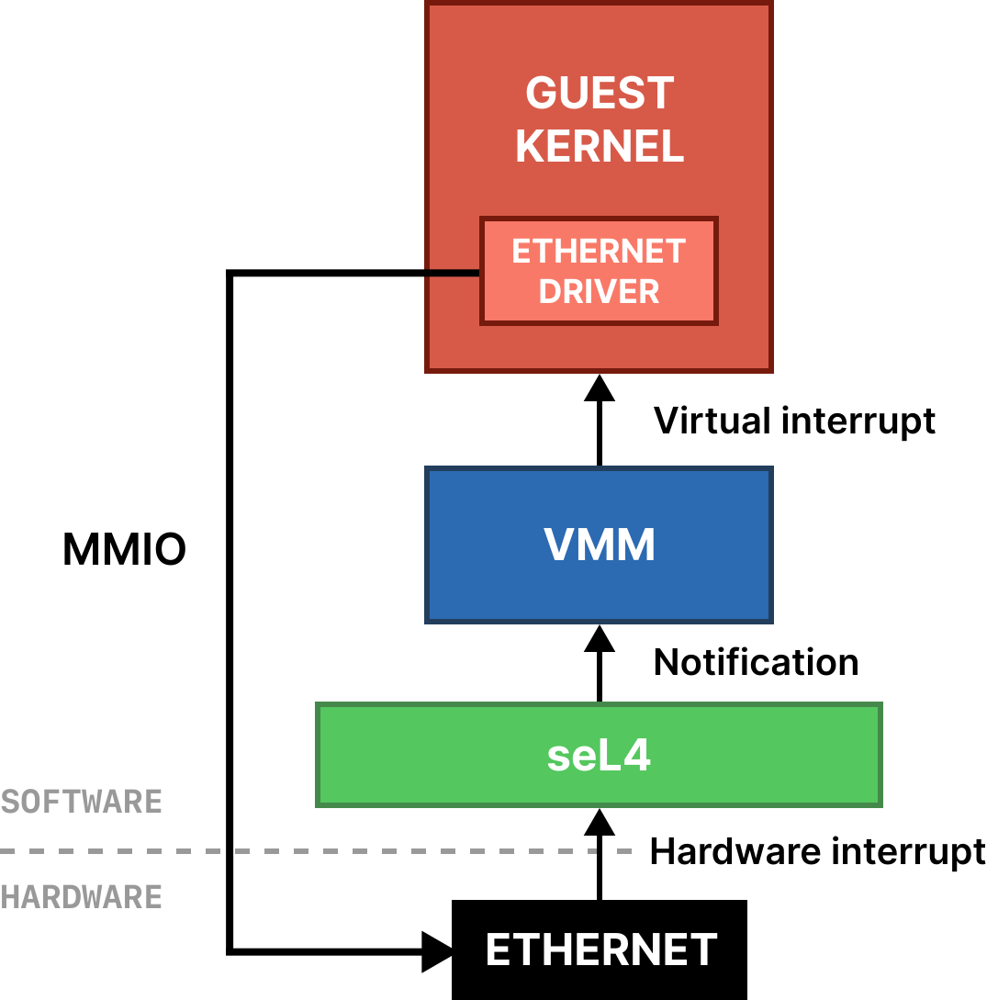
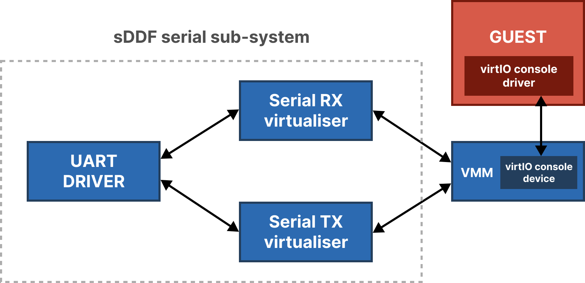

\maketitle
\thispagestyle{empty}
\clearpage
\tableofcontents
\pagenumbering{roman}
\clearpage
\pagenumbering{arabic}
\setcounter{page}{1}

# Introduction

This document aims to describe the libvmm project and how to use it. If you feel there is
something missing from this document or libvmm itself, feel free to let us
know by [opening an issue on the GitHub repository](https://github.com/au-ts/libvmm).

## Supported architectures and platforms

Currently only AArch64 is supported in libvmm. Support for RISC-V is in progress,
with x86 to be potentially added in the future.

libvmm aims to be architecture-dependent, but not platform dependent.

Example systems that make use of libvmm can be found in `examples/`. Each example
has support for certain platforms. See the README of each example for what platforms
are supported and instructions for building and running the example.

If your desired platform is not supported by any examples, please see the section on
[adding your own platform support](#adding-platform-support).

# Creating a system using Microkit

The goal of this section is to give a detailed introduction into making a
system using libvmm with the [seL4 Microkit](https://github.com/seL4/microkit).
This is done by explaining one of the example QEMU ARM virt systems that boots
up a simple Linux guest.

All the existing systems are located in `board/$BOARD/systems/`. This is
where the Makefile will look when you pass the `SYSTEM` argument.

## Specifying a virtual machine

<!-- @ivanv: point to Microkit manual for all options on virtual_machine elements. -->

The first step before writing code is to have a system description that contains
a virtual machine and the VMM protection domain (PD).

The following is essentially what is in
[the QEMU example system](../board/qemu_arm_virt/systems/simple.system),

```xml
<memory_region name="guest_ram" size="0x10_000_000" />
<memory_region name="uart" size="0x1_000" phys_addr="0x9000000" />
<memory_region name="gic_vcpu" size="0x1_000" phys_addr="0x8040000" />

<protection_domain name="VMM" priority="254">
    <program_image path="vmm.elf" />
    <map mr="guest_ram" vaddr="0x40000000" perms="rw" setvar_vaddr="guest_ram_vaddr" />
    <virtual_machine name="linux" id="0">
        <map mr="guest_ram" vaddr="0x40000000" perms="rwx" />
        <map mr="uart" vaddr="0x9000000" perms="rw" />
        <map mr="gic_vcpu" vaddr="0x8010000" perms="rw" />
    </virtual_machine>
</protection_domain>
```

First we create a VMM as a root PD that contains a virtual machine (VM).
This hierarchy is necessary as the VMM needs to be able to access the guest's
TCB registers and VCPU registers for initialising the guest, delivering virtual
interrupts to the guest and restarting the guest.

You will also see that three memory regions (MRs) exist in the system.
1. `guest_ram` for the guest's RAM region
2. `uart` for the UART serial device
3. `gic_vcpu` for the Generic Interrupt Controller VCPU interface

## Guest RAM region

Since the guest does not necessarily know it is being virtualised, it will
expect some view of contiguous RAM that it can use. In this example system, we
decide to give the guest 256MiB to use as "RAM", however you can provide
however much is necessary for your guest. At a bare minimum, there needs to be
enough memory to place the kernel image and any other associated binaries. How
much memory is required for it to function depends on what you intend to do
with the guest.

This region is mapped into the VMM so that it can copy in the kernel image and
any other binaries and is of course also mapped into the virtual machine so
that it has access to its own RAM.

We can see that the region is mapped into the VMM with
`setvar_vaddr="guest_ram_vaddr"`. The VMM expects that variable to contain
the starting address of the guest's RAM. With the current implementation of the
VMM, it expects that the virtual address of the guest RAM that is mapped into
the VMM as well as the guest physical address of the guest RAM to be the same.
This is done for simplicity at the moment, but could be changed in the future
if someone had a strong desire for the two values to not be coupled.

## UART device region

The UART device is passed through to the guest so that it can access it without
trapping into the seL4 kernel/VMM. This is done for performance and simplicity
so that the VMM does not have to emulate accesses to the UART device. Note that
this will work since nothing else is concurrently accessing the device.

## GIC virtual CPU interface region

The GIC VCPU interface region is a hardware device region passed through to the
guest. The device is at a certain physical address, which is then mapped into
the guest at the address of the GIC CPU interface that the guest expects. In the
case of the example above, the GIC VCPU interface is at `0x8040000`, and we map
this into the guest physical address of `0x8010000`, which is where the guest
expects the CPU interface to be. The rest of the GIC is virtualised in the VGIC
driver in the VMM. Like the UART, the address of the GIC is platform specific.

# Passthrough

This section describes what is generally referred to as "passthrough". Passthrough
is for when you want to have a guest have full, unmanaged control over some device
or memory. Since the guest has full access to the device/memory, when it does a read
or a write it essentially "passes through" the hypervisor.

## Concept

It is necessary to understand passthrough conceptually (in an seL4 context) before
being able to use it with libvmm.

The diagram above below shows an example of passing through an ethernet device to
a guest.

{#id .class width=300}

You will see here there are multiple stages involved. When there is some event from
the hardware, seL4 recieves an interrupt from the hardware. seL4 then delivers this
IRQ as a notification to the VMM. The VMM associates this notification with the IRQ
that the virtual IRQ that the guest is expecting to recieve. The VMM then "injects"
a virtual IRQ into the guest, emulating the behaviour of hardware interrupting the guest
kernel if it wasn't being virtualised.

## Example within Microkit

## Interrupt passthrough on ARM

A common mistake when passing through the interrupts for a device on ARM platforms
is making the reasonable assumption that the device tree (or the platform's manual)
contains the actual information you want. When registering the interrupt to be delivered to the VMM,
you want the *software observable* interrupt number. The number that you see in
device trees for example with something like `interrupts = <0x00 0x08 0x04>;`
is the interrupt number from the *hardware's* perspective.

On ARM, shared peripheral interrupts (SPIs) which are delivered by devices such as
ethernet need to be offset by 32. So in the example above, the device tree listed interrupt
is `0x08`, but the interrupt number you want to register with seL4 is `0x28` (0x28 is 40 in decimal).
For more information on ARM interrupts, see the official ARM documentation on the Generic Interrupt
Controller (GIC).

The Linux kernel documentation has more information on how interrupts are specified
in the device tree. See device tree bindings documentation for the platform's
interrupt controller (e.g the GIC) or for the specific device you are trying to use.
Note that not all devices encode interrupts the same.

## Passing through DMA devices

Devices which communicate through DMA see the world through host physical
addresses, however virtual machines will give devices guest physical addresses
(i.e., host virtual addresses).  In order for DMA passthrough to work, these two
addresses must be aligned. This can be done by setting the `phys_addr` of the
guest's RAM to be the same as its mapped virtual address.
```xml
<memory_region name="guest_ram" size="0x10_000_000" phys_addr="0x20000000" page_size="0x200_000" />
<protection_domain ...>
    <virtual_machine ...>
        <map mr="guest_ram" vaddr="0x20000000" perms="rwx" />
        <!-- ... -->
    </virtual_machine>
    <!-- ... -->
</protection_domain>
```

# virtIO

virtIO is a standard interface between guests and hypervisors to faciliate the use of devices
where the guest does not have access to the underlying hardware.

libvmm provides a number of virtIO devices to enable guests to interact with the outside world.

libvmm follows [version 1.2 of the virtIO specification](https://docs.oasis-open.org/virtio/virtio/v1.2/virtio-v1.2.html)
and implements the following devices:

* Console
* Block
* Sound
* Socket

These devices are implemented using MMIO, we do not use any PCI devices at this stage.

For virtIO devices that result in actual I/O (as opposed to purely virtual devices like socket),
libvmm uses  the protocols and interfaces provided by the
[seL4 Device Driver Framework](https://github.com/au-ts/sddf). This allows libvmm to
interact with the outside world in a standard way just like any other native client program.

This means that these virtIO device implementations are generic and are not dependent on the
platform or architecture that libvmm is being used on.

## Example architecture

Below is an example architecture where a guest is making use of a virtIO console device.

You can see that virtIO console transmit ends up talking to a real UART device, and data received
by the UART device will then be received by the virtIO console device in libvmm which will then
be passed up to the guest.

You can also find an actual working example making use of the virtIO devices in libvmm in the repository
at `examples/virtio`.

{#virtio .class width=500}

## Devices

### Console

The console device makes use of the 'serial' device class in sDDF. It supports one port.

None of the feature bits are implemented. The legacy interface is not supported.

The console device communicates with a hardware serial device via two sDDF serial virtualisers,
one for recieve and one for transmit.

There are plans to extend the console device implementation, you can find more details
on [this GitHub issue](https://github.com/au-ts/libvmm/issues/27).

### Block

The block device makes use of the 'block' device class in sDDF.

The following feature bits are implemented:

* VIRTIO_BLK_F_FLUSH
* VIRTIO_BLK_F_BLK_SIZE

The legacy interface is not supported.

The block device communicates with a hardware block device via a sDDF block virtualiser.

### Sound

The sound device makes use of the 'sound' device class in sDDF.

There are no feature bits to implement. The legacy interface is not supported.

The sound device communicates with a hardware sound device via a sDDF sound virtualiser.

### Socket

The socket device (commonly referred to as 'vsock') is a virtual socket device that allows
for communication between guests without setting up a network.

The following features bits are implemented:

* VIRTIO_VSOCK_F_STREAM

Since the socket device is a purely virtual concept, it does not connect to a device via sDDF
and instead communicates directly with other guests.

# Adding platform support

This section will describe how to add support for a new platform to the `simple`
example which contains a VMM that boots a Linux guest with a simple command-line-interface
via the serial connection.

Before you can get a guest working on your desired platform you must have the following:

* A working platform port of the seL4 kernel in hypervisor mode.
* A working platform port of the seL4 Microkit where the kernel is configured in hypervisor mode.

## Guest setup

While in theory you should be able to run any guest, the VMM has only been tested
with Linux and hence the following instructions are somewhat Linux specific.

Required guest files:

* Kernel image
* Device Tree Source to be passed to the kernel at boot
* Initial RAM disk

Each platform image directory (`board/$BOARD/images`) contains a README with
instructions on how to reproduce the images used if you would like to see
examples of how other example systems are setup.

Before attempting to get the VMM working, I strongly encourage you to make sure
that these binaries work natively, as in, without being virtualised. If they do
not, they likely will not work with the VMM either.

Add these images to the `board/$BOARD/` directory or specify the
`IMAGE_DIR` argument when building the system which points to the directory
that contains all of the files.

### Implementation notes

Currently the VMM expects three separate images, the guest kernel image, the
Device Tree Blob (DTB), and the initial RAM disk. Despite it being possible to
package all of these into one single image for a guest such as Linux, there has
currently been no benefit to do this. It would be trivial to change the VMM to
allow a different combination of guest images. If you need this behaviour, please
open a GitHub issue or pull request.

The VMM also (for now) does not have the ability to generate a DTB at runtime,
therefore requiring the Device Tree Source at build time.

## Generic Interrupt Controller (GIC)

On ARM architectures, there is a hardware device called the Generic Interrupt
Controller (GIC). This device is responsible for managing interrupts between
the hardware devices (e.g serial or ethernet) and software. Driving this device
is necessary for any kind of guest operating system.

Version 2, 3, and 4 of the GIC device is not fully virtualised by the hardware.
This means that the parts that are not virtualised by the hardware must be instead
emulated by the VMM.

The VMM currently supports GIC version 2 and 3. GIC version 4 is a super-set of
GIC version so if you see that your platform supports GIC version 4, it should
still work with the VMM. If your platform does not support the GIC versions listed
then the GIC emulation will need to be changed before your platform can be supported.

## Add platform to VMM source code

<!-- @ivanv: These instructions could be improved -->

Lastly, there are some hard-coded values that the VMM needs to support a platform.
There are three files that need to be changed:

* `src/vmm.h`
* `src/vgic/vgic.h`
* For Linux, the device tree needs to contain the location of the initial RAM disk,
  see the `chosen` node of `board/qemu_arm_virt/images/linux.dts` as an example.

As you can probably tell, all this information that needs to be added is known at
build-time, the plan is to auto-generate these values that the VMM needs to make it
easier to add platform support (and in general make the VMM less fragile).

## Getting the guest image to boot

Getting your guest image to boot without any issues is most likely going to be
platform dependent. This part of the manual aims to provide some guidance for
what to do when your guest image is failing to boot.

### Virtual memory faults

A very common issue with booting a guest kernel, such as Linux, is that it unexpectedly
has a virtual memory fault in a location that the VMM was not expecting. In Linux, this
usually happens as it is starting up drivers for the various devices on the platform and
the guest does not have access to the location of the device.

There are three options to resolve this.

1. Give the guest access to the region of memory it is trying to access.
2. Disable the device in the node for the device in the Device Tree Source.
3. Configure the guest image without the device driver, so that it does not
try to access it.

#### Option 1 - give the guest access to the memory

See the section on [passthrough devices](#passthrough).

#### Option 2 - disabling the device in the device tree

Assuming the guest is being passed a device tree and initialising devices
based on the device tree passed, it is quite simple to disable the device.

Here is an example of how you would change the Device Tree Source to
disable the PL011 UART node for the QEMU ARM virt platform:
```diff
pl011@9000000 {
    clock-names = "uartclk\0apb_pclk";
    clocks = <0x8000 0x8000>;
    interrupts = <0x00 0x01 0x04>;
    reg = <0x00 0x9000000 0x00 0x1000>;
    compatible = "arm,pl011\0arm,primecell";
+   status = "disabled";
};
```

#### Option 3 - configure the guest without the device driver

We will look at Linux for specific examples of how to configure the device
drivers it will use.

A default and generic Linux image (for AArch64) can be built with the following
commands:
```sh
# Configure the kernel based on the default architecture config
make ARCH=arm64 CROSS_COMPILE=<CROSS_COMPILER_PREFIX> defconfig
# Compile the kernel
make ARCH=arm64 CROSS_COMPILE=aarch64-none-elf -j<NUM_THREADS>
```

This will package in a lot of drivers (and perhaps a lot more than you need)
as it is a generic image supposed to work on any AArch64 platform. If you
see that Linux is faulting because it is initialising a particular device,
look in the menu configuration and try to find the enabled option, and
disable it.

To open the menuconfig, run:
```sh
make ARCH=arm64 menuconfig
```

If you are compiling for a different architecture, then replace `arm64` with
your architecture.

If you are unsure or cannot find the configuration option for the device driver,
first find the node for the device in the Device Tree Source. You will see it
has a compatible field such as `compatible = "amlogic,meson-gx-uart"`.

By searching for the value of the compatible field in the Linux source code (e.g `grep -ri 'amlogic,meson-gx-uart'`),
you will find the corresponding driver source code.
