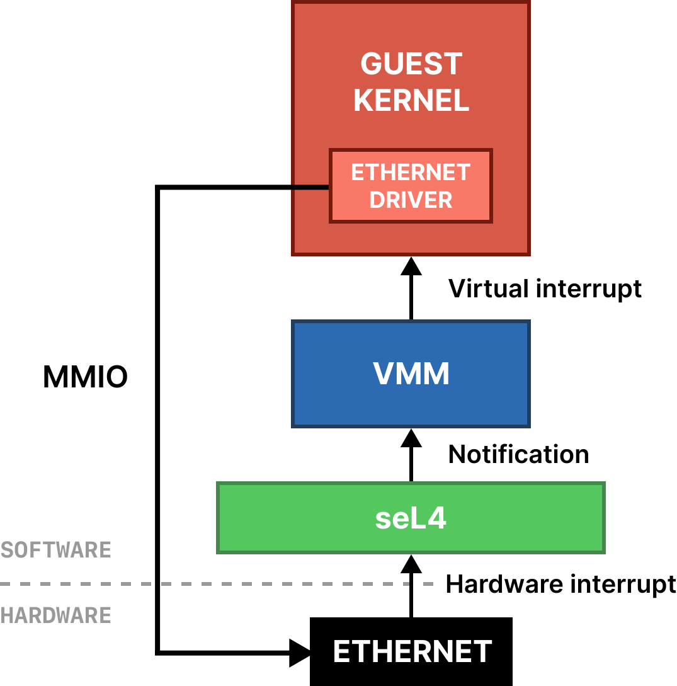
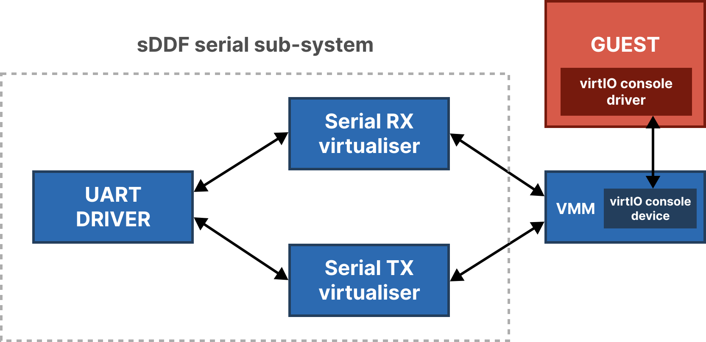

<!--
     Copyright 2024, UNSW
     SPDX-License-Identifier: CC-BY-SA-4.0
-->

---
title: libvmm User Manual (v0.1)
papersize:
- a4
fontsize:
- 11pt
geometry:
- margin=2cm
fontfamily:
- charter
header-includes:
- \usepackage{titlesec}
- \newcommand{\sectionbreak}{\clearpage}
subparagraph: yes
numbersections: yes
colorlinks: true
---

\maketitle
\thispagestyle{empty}
\clearpage
\tableofcontents
\pagenumbering{roman}
\clearpage
\pagenumbering{arabic}
\setcounter{page}{1}

# Introduction

This document aims to describe the libvmm project and how to use it. If you feel there is
something missing from this document or libvmm itself, feel free to let us
know by [opening an issue on the GitHub repository](https://github.com/au-ts/libvmm).

## Supported architectures and platforms

Currently only AArch64 and x86-64 are supported in libvmm. Support for RISC-V is in progress.

libvmm aims to be architecture-dependent, but not platform dependent.

Example systems that make use of libvmm can be found in `examples/`. Each example
has support for certain platforms. See the README of each example for what platforms
are supported and instructions for building and running the example.

If your desired platform is not supported by any examples, please see the section on
[adding your own platform support](#adding-platform-support).

### x86-64 hardware requirements
To run the VMM, you will need a host with an Intel 64-bit CPU and VT-x enabled in your BIOS.
AMD CPUs aren't supported as the seL4 kernel does not implement their virtualisation extension
at the moment.

Virtualising the VMM on QEMU is supported, though if you are on QEMU, you might see Linux
complaining:
```
[   57.377976] clocksource: timekeeping watchdog on CPU0: hpet wd-wd read-back delay of 602100ns
[   57.381493] clocksource: wd-tsc-wd read-back delay of 521600ns, clock-skew test skipped!
```
This is normal for QEMU due to the higher overhead of nested virtualisation. You
won't see this problem on bare-metal.

# Creating a system using Microkit

The goal of this section is to give a detailed introduction into making a
system using libvmm with the [seL4 Microkit](https://github.com/seL4/microkit).
This is done by explaining one of the example QEMU virt AArch64 systems that boots
up a simple Linux guest.

All the existing systems are located in `board/$BOARD/systems/`. This is
where the Makefile will look when you pass the `SYSTEM` argument.

## Specifying a virtual machine

The first step before writing code is to have a system description that contains
a virtual machine and the VMM protection domain (PD).

### AArch64
The following is essentially what is in
[the QEMU example system](../examples/simple/board/qemu_virt_aarch64/simple.system):

```xml
<memory_region name="guest_ram" size="0x10_000_000" />
<memory_region name="serial" size="0x1_000" phys_addr="0x9000000" />
<memory_region name="gic_vcpu" size="0x1_000" phys_addr="0x8040000" />

<protection_domain name="VMM" priority="254">
    <program_image path="vmm.elf" />
    <map mr="guest_ram" vaddr="0x40000000" perms="rw" setvar_vaddr="guest_ram_vaddr" />
    <virtual_machine name="linux" >
        <vcpu id="0" />
        <map mr="guest_ram" vaddr="0x40000000" perms="rwx" />
        <map mr="serial" vaddr="0x9000000" perms="rw" cached="false" />
        <map mr="gic_vcpu" vaddr="0x8010000" perms="rw" cached="false" />
    </virtual_machine>
    <irq irq="33" id="1" />
</protection_domain>
```

First we create a VMM as a root PD that contains a virtual machine (VM).
This hierarchy is necessary as the VMM needs to be able to access the guest's
TCB registers and vCPU registers for initialising the guest, delivering virtual
interrupts to the guest and restarting the guest.

You will also see that three memory regions (MRs) exist in the system.
1. `guest_ram` for the guest's RAM region. Mapped at Guest Physical Address (GPA)
`0x40000000` under `<virtual_machine name="linux" >`
2. `serial` for the UART serial device
3. `gic_vcpu` for the Generic Interrupt Controller vCPU interface

### x86-64
There are more components involved on x86, the following is what is in
[the QEMU example system](../../examples/simple/board/x86_64_generic_vtx/simple.system):

```xml
<memory_region name="hpet_regs" size="0x1000" phys_addr="0xfed00000" />
<memory_region name="guest_ram" size="0x10_000_000" />

<protection_domain name="VMM" priority="0" stack_size="0x2000">
    <program_image path="vmm.elf" />
    <map mr="guest_ram" vaddr="0x80000000" perms="rw" setvar_vaddr="guest_ram_vaddr" />
    <virtual_machine name="linux">
        <vcpu id="0"/>
        <map mr="guest_ram" vaddr="0" perms="rwx" cached="true" />
    </virtual_machine>

    <ioport id="0" addr="0x3f8" size="8" />
    <irq pin="4" vector="41" id="1" ioapic="0" trigger="edge"/>
</protection_domain>

<protection_domain name="timer_driver" priority="254" passive="true">
    <program_image path="timer_driver.elf" />
    <map mr="hpet_regs" vaddr="0x50000000" perms="rw" cached="false" />
    <irq pin="2" vector="107" id="0" ioapic="0" trigger="edge" />
</protection_domain>

<channel>
    <end pd="timer_driver" id="1" />
    <end pd="VMM" id="10" notify="false" pp="true" />
</channel>
```

The general structure of the protection domain is the same, but the underlying
implementation detail is different. There is only 1 TCB and 1 VCPU object inside
the VMM protection domain. The VMM switches between guest and non-guest execution
mode depends on the current state of the virtual machine.

There is no dedicated memory region for virtualising the APIC, as currently we
only provide a software emulated one so all the state are kept inside a
statically allocated structure. Support for Intel APICv hardware acceleration
is currently being worked on.

For serial output, we passthrough the host's COM1 port (0x3f8) and IRQ (pin 4)
to the guest.

You will also see that there is a timer driver for the VMM. This is for the VMM
to measure the frequency of the CPU's Time Stamp Counter (TSC) in case where it
cannot be inferred.

## Guest RAM region

Since the guest does not necessarily know it is being virtualised, it will
expect some view of contiguous RAM that it can use. In this example system, we
decide to give the guest 256MiB to use as "RAM", however you can provide
however much is necessary for your guest. At a bare minimum, there needs to be
enough memory to place the kernel image and any other associated binaries. How
much memory is required for it to function depends on what you intend to do
with the guest.

This region is mapped into the VMM so that it can copy in the kernel image and
any other binaries and is of course also mapped into the virtual machine so
that it has access to its own RAM.

We can see that the region is mapped into the VMM with
`setvar_vaddr="guest_ram_vaddr"`. The VMM expects that variable to contain
the starting address of the guest's RAM. There is no requirements for the
VMM virtual address and guest physical address of RAM to match, as the VMM
will automatically translate them as necessary during the fault handling process.

### ARM discovery

The Guest Physical Address (GPA) and size of guest RAM must match what you
declared in the device tree.

### x86 discovery

There must be a guest RAM region starting from GPA 0. All of the guest RAM
regions you declared via the `guest_init()` API will be made available to the
guest via an E820 table.

## UART device passthrough

On most examples, the UART device is passed through to the guest so that it can
access it without trapping into the seL4 kernel/VMM. This is done for performance
and simplicity so that the VMM does not have to emulate accesses to the UART
device. Note that this will work since nothing else is concurrently accessing
the device.

## ARM GIC virtual CPU interface region

The GIC vCPU interface is used to virtualise the CPU interface for a guest.

Depending on the ARM platform, the GIC vCPU/CPU interface may be via system
registers or MMIO.

For the QEMU platform, the GIC vCPU/CPU interface is via MMIO and so we
map the vCPU interface's physical memory region into the guest as the
*CPU interface*. In this case the GIC vCPU interface is at `0x8040000`, and we map
this into the guest physical address of `0x8010000`, which is where the guest
expects the CPU interface to be. Like the UART, the address of the GIC is
platform specific.

If the CPU interface was via system registers, we would not have to map any
region for the GIC into the guest.

The rest of the GIC is virtualised in the vGIC driver in libvmm.

## Multiple vCPUs

There is support for multiple vCPUs (up to 16) on ARM. The number of vCPUs that
the VMM will manage is configured when setting up the guest via `guest_init`.

libvmm expects the vCPU IDs to be consecutive, with zero being the boot vCPU ID.

When making use of multiple vCPUs make sure that the guest is aware there are
multiple CPUs enabled (e.g in the Device Tree).

Support for multiple vCPUs on x86 is in progress.

# Passthrough

This section describes what is generally referred to as "passthrough". Passthrough
is for when you want to have a guest have full, unmanaged control over some device
or memory. Since the guest has full access to the device/memory, when it does a read
or a write it essentially "passes through" the hypervisor.

## Concept

It is necessary to understand passthrough conceptually (in an seL4 context) before
being able to use it with libvmm.

The diagram above below shows an example of passing through an ethernet device to
a guest.

{#id .class width=300}

You will see here there are multiple stages involved. When there is some event from
the hardware, seL4 receives an interrupt from the hardware. seL4 then delivers this
IRQ as a notification to the VMM. The VMM associates this notification with the IRQ
that the virtual IRQ that the guest is expecting to receive. The VMM then "injects"
a virtual IRQ into the guest, emulating the behaviour of hardware interrupting the guest
kernel if it wasn't being virtualised.

## Example within Microkit

## Interrupt passthrough on ARM

A common mistake when passing through the interrupts for a device on ARM platforms
is making the reasonable assumption that the device tree (or the platform's manual)
contains the actual information you want. When registering the interrupt to be delivered to the VMM,
you want the *software observable* interrupt number. The number that you see in
device trees for example with something like `interrupts = <0x00 0x08 0x04>;`
is the interrupt number from the *hardware's* perspective.

On ARM, shared peripheral interrupts (SPIs) which are delivered by devices such as
ethernet need to be offset by 32. So in the example above, the device tree listed interrupt
is `0x08`, but the interrupt number you want to register with seL4 is `0x28` (0x28 is 40 in decimal).
For more information on ARM interrupts, see the official ARM documentation on the Generic Interrupt
Controller (GIC).

The Linux kernel documentation has more information on how interrupts are specified
in the device tree. See device tree bindings documentation for the platform's
interrupt controller (e.g the GIC) or for the specific device you are trying to use.
Note that not all devices encode interrupts the same.

## Passing through DMA devices

### ARM

Devices which communicate through DMA see the world through host physical
addresses, however virtual machines will give devices guest physical addresses
(i.e., host virtual addresses).  In order for DMA passthrough to work, these two
addresses must be aligned. This can be done by setting the `phys_addr` of the
guest's RAM to be the same as what you declares as RAM start in the guest DTS.
```xml
<memory_region name="guest_ram" size="0x10_000_000" phys_addr="0x20000000" page_size="0x200_000" />
```

```
memory@20000000 {
    reg = <0x00 0x20000000 0x00 0x80000000>;
    device_type = "memory";
};
```

### x86

This is currently unsupported because guest RAM starts from guest physical address zero, and you can't start
memory regions from host physical address zero.

To solve this we need to use the IOMMU (Intel VT-d),
support for this is being worked on.

# virtIO

virtIO is a standard interface between guests and hypervisors to facilitate the use of devices
where the guest does not have access to the underlying hardware.

libvmm provides a number of virtIO devices to enable guests to interact with the outside world.

libvmm follows [version 1.2 of the virtIO specification](https://docs.oasis-open.org/virtio/virtio/v1.2/virtio-v1.2.html)
and implements the following devices:

* Console
* Block
* Network

These devices can be registered on either MMIO or PCI buses, which is transparent to
device-specific implementation.

For each of these devices, libvmm will perform I/O using the protocols and interfaces provided
by the [seL4 Device Driver Framework](https://github.com/au-ts/sddf). This allows libvmm to
interact with the outside world in a standard way just like any other native client program.

This means that these virtIO device implementations are generic and are not dependent on the
platform or architecture that libvmm is being used on.

## Example architecture

Below is an example architecture where a guest is making use of a virtIO console device.

You can also find a working example making use of virtIO devices with libvmm in the repository
at `examples/virtio` or `examples/virtio_pci`.

{.class width=500}

## Devices

### Console

The console device makes use of the 'serial' device class in sDDF. It supports one port.

None of the feature bits are implemented. The legacy interface is not supported.

The console device communicates with a hardware serial device via two sDDF serial virtualisers,
one for receive and one for transmit.

There are plans to extend the console device implementation, you can find more details
on [this GitHub issue](https://github.com/au-ts/libvmm/issues/27).

### Block

The block device makes use of the 'block' device class in sDDF.

The following feature bits are implemented:

* VIRTIO_BLK_F_FLUSH
* VIRTIO_BLK_F_BLK_SIZE
* VIRTIO_BLK_F_SIZE_MAX
* VIRTIO_BLK_F_SEG_MAX
* VIRTIO_BLK_F_TOPOLOGY

The legacy interface is not supported.

The block device communicates with a hardware block device via a sDDF block virtualiser.

### Network

The network device makes use of the 'net' device class in sDDF.

The device supports `VIRTIO_NET_F_MAC`. No other features are available.

The legacy interface is not supported.

The network device communicates with a hardware network card via a pair of sDDF RX and TX
net virtualisers. This communication may be done through
intermediary components such as a virtual network switch (VSwitch).

## PCI support

We have the ability to emulate virtIO PCI devices.

Currently it is assumed that only one PCI node exists, and each device on the PCI bus
has only one function.

BARs are assumed to be 32-bit.

These limitations exist because for our current use-cases this PCI support is sufficient,
however the functionality can be extended if needed.

## Architectural support

### ARM

Both MMIO and PCI virtIO devices are supported on ARM. Currently we provide examples for
QEMU and the Avnet MaaXBoard, as we have corresponding serial, ethernet and block drivers
in sDDF for those platforms.

### x86

Only PCI virtIO devices are supported on x86. Currently, only QEMU target are supported
due to a lack of x86 drivers in sDDF. We are currently working adding more x86 drivers
in sDDF which will unlock more hardware support.

# Adding ARM platform support

The library itself is intended to need minimal changes to add a new platform.

The following changes are necessary:

* Platform vGIC version and physical address (see `src/arch/aarch64/vgic/vgic.h`).
* If the platform uses GICv3, you will need to change the top-level Makefile snippet
  (`vmm.mk`) to account for that.

Before you can get a guest working on your desired platform you must have the following:

* A working platform port of the seL4 kernel in hypervisor mode.
* A working platform port of the seL4 Microkit where the kernel is configured in hypervisor mode.

## Porting the simple example

This section will be a guide on adding support for a new platform to the `simple`
example which contains a minimal VMM capable of booting a Linux guest with
a simple user-space command-line-interface via the serial device.

The simple example can be found in `examples/simple` from the root of the libvmm source.

### Guest setup

Required guest files:

* Kernel image
* Device Tree Source to be passed to the kernel at boot
* Initial RAM disk

Each platform image directory (`board/$BOARD/`) contains a README with
instructions on how to reproduce the images used if you would like to see
examples of how other example systems are setup.

Before attempting to get the VMM working, we strongly encourage you to make sure
that these binaries work natively, as in, without being virtualised. If they do
not, they likely will not work with the VMM either.

Add these images to the `board/$BOARD/` directory following the same naming
conventions as other platforms so that the build system can find them.

### Implementation notes

Currently the VMM expects three separate images, the guest kernel image, the
Device Tree Blob (DTB), and the initial RAM disk. Despite it being possible to
package all of these into one single image for a guest such as Linux, there has
currently been no benefit to do this. It would be trivial to change the VMM to
allow a different combination of guest images. If you need this behaviour, please
open a GitHub issue or pull request.

The VMM also (for now) does not have the ability to generate a DTB at runtime,
therefore requiring the Device Tree Source at build time.

## Generic Interrupt Controller (GIC)

On ARM architectures, there is a hardware device called the Generic Interrupt
Controller (GIC). This device is responsible for managing interrupts between
the hardware devices (e.g serial or ethernet) and software. Driving this device
is necessary for any kind of guest operating system.

Version 2, 3, and 4 of the GIC device is not fully virtualised by the hardware.
This means that the parts that are not virtualised by the hardware must be instead
emulated by the VMM.

The VMM currently supports GIC version 2 and 3. GIC version 4 is a super-set of
GIC version so if you see that your platform supports GIC version 4, it should
still work with the VMM. If your platform does not support the GIC versions listed
then the GIC emulation will need to be changed before your platform can be supported.

## Add platform to VMM source code

The VMM library code need to know the physical address of the GIC distributor
(and redistributor for GICv3 platforms). This needs to be defined in
[vgic.h](../include/libvmm/arch/aarch64/vgic/vgic.h).

## Getting the guest image to boot

Getting your guest image to boot without any issues is most likely going to be
platform dependent. This part of the manual aims to provide some guidance for
what to do when your guest image is failing to boot.

### Virtual memory faults

A very common issue with booting a guest kernel, such as Linux, is that it unexpectedly
has a virtual memory fault in a location that the VMM was not expecting. In Linux, this
usually happens as it is starting up drivers for the various devices on the platform and
the guest does not have access to the location of the device.

There are three options to resolve this.

1. Give the guest access to the region of memory it is trying to access.
2. Disable the device in the node for the device in the Device Tree Source.
3. Configure the guest image without the device driver, so that it does not
try to access it.

#### Option 1 - give the guest access to the memory

See the section on [passthrough devices](#passthrough).

#### Option 2 - disabling the device in the device tree

Assuming the guest is being passed a device tree and initialising devices
based on the device tree passed, it is quite simple to disable the device.

Here is an example of how you would change the Device Tree Source to
disable the PL011 UART node for the QEMU virt AArch64 platform:
```diff
pl011@9000000 {
    clock-names = "uartclk\0apb_pclk";
    clocks = <0x8000 0x8000>;
    interrupts = <0x00 0x01 0x04>;
    reg = <0x00 0x9000000 0x00 0x1000>;
    compatible = "arm,pl011\0arm,primecell";
+   status = "disabled";
};
```

#### Option 3 - configure the guest without the device driver

We will look at Linux for specific examples of how to configure the device
drivers it will use.

A default and generic Linux image (for AArch64) can be built with the following
commands:
```sh
# Configure the kernel based on the default architecture config
make ARCH=arm64 CROSS_COMPILE=<CROSS_COMPILER_PREFIX> defconfig
# Compile the kernel
make ARCH=arm64 CROSS_COMPILE=aarch64-none-elf -j<NUM_THREADS>
```

This will package in a lot of drivers (and perhaps a lot more than you need)
as it is a generic image supposed to work on any AArch64 platform. If you
see that Linux is faulting because it is initialising a particular device,
look in the menu configuration and try to find the enabled option, and
disable it.

To open the menuconfig, run:
```sh
make ARCH=arm64 menuconfig
```

If you are compiling for a different architecture, then replace `arm64` with
your architecture.

If you are unsure or cannot find the configuration option for the device driver,
first find the node for the device in the Device Tree Source. You will see it
has a compatible field such as `compatible = "amlogic,meson-gx-uart"`.

By searching for the value of the compatible field in the Linux source code (e.g `grep -ri 'amlogic,meson-gx-uart'`),
you will find the corresponding driver source code.

# API Overview

To create a virtual machine with libvmm, you must first initialise the
library itself, and the archiecture specific subsystems within the library,
such as the virtual interrupt controller. This is accomplished by calling
`guest_init()` with a `arch_guest_init_t` object in your Microkit PD's
`init()` entrypoint. The structure of this object is
architecture specific and provide details about your setup to the
library. See [guest.h](../include/libvmm/guest.h) for more details.

Once the library is initialised, you can load your guest's Operating
System (OS). We provide an architecture-specific helper function
`linux_setup_images()` for you to easily load a Linux kernel and
initial ramdisk image according to the Linux boot protocol.

You are free to load other OSes or bootloaders according to their
protocol. You can convert a destination Guest Physical Address
to a Host (Hypervisor) Virtual Address for copying by calling
`gpa_to_hva()`. See [guest_ram.h](../include/libvmm/guest_ram.h)
for more details on this operation.

Once the library is initialised and the guest OS loaded, the virtual
machine is ready to start. Before you start the VM, you will need to
grant the VM access to any passthrough devices if applicable. For example,
by calling `microkit_vcpu_x86_enable_ioport()` on x86 specifically, and
making sure that the device's MMIO registers are mapped into guest RAM
at the expected Guest Physical Address and their interrupts registered with
`virq_register_passthrough()` generally.

If you passed through a device and they are capable of raising an interrupt,
it is crucial that you call `virq_handle_passthrough()` in the `notified()`
Microkit entrypoint so that the interrupt get delivered to the guest.

To start the VM, call the appropriate start function from
[guest.h](../include/libvmm/guest.h) and return from the `init()` Microkit
entrypoint.

Faults from the VM are delivered to the `fault()` Microkit entrypoint.
Call `fault_handle()` to handle the fault and return from `fault()` to
resume the VM. On x86, metadata of the faults are passed via message
registers. It's crucial that you do not attempt to write to the message
registers before `fault_handle()` is called.
