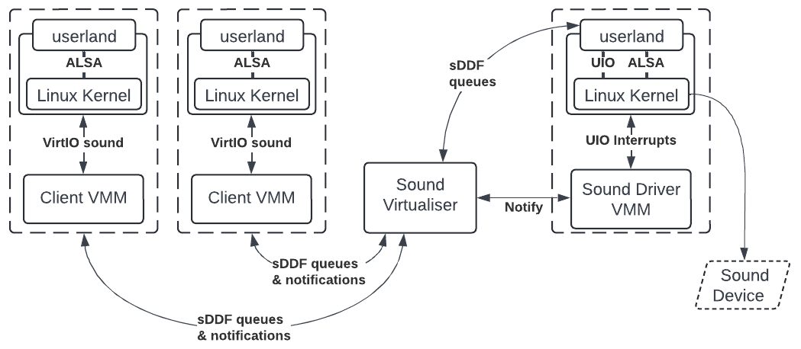
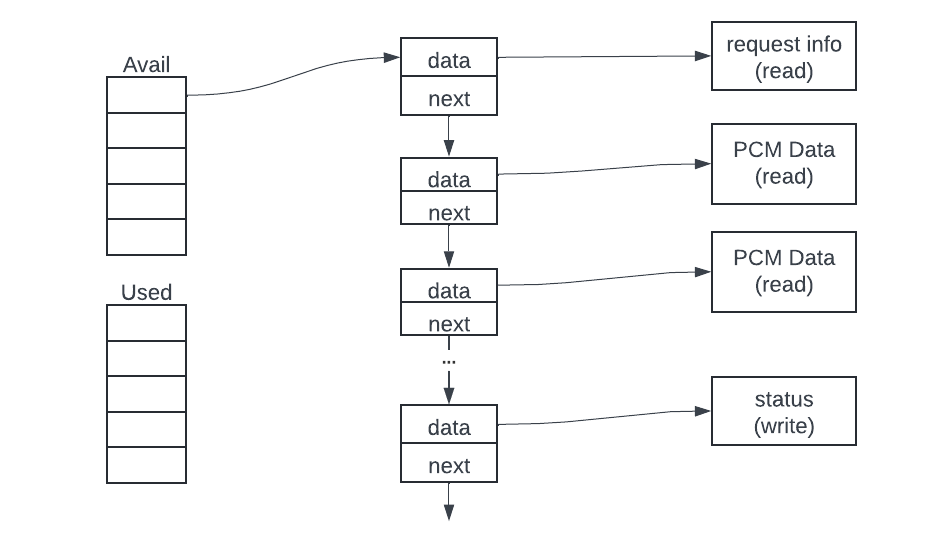

Sound in LionsOS
================
*Implementation and design document written by Alex Brown, April 2024.*
# 1. Usage

## 1.1. How to boot
### 1.1.1 Qemu
```
nix-shell shell.nix --pure --run \
	"make MICROKIT_SDK=/PATH/TO/microkit-sdk BOARD=qemu_arm_virt QEMU_SND_BACKEND=coreaudio qemu"
```
- Swap `coreaudio` out for an appropriate Qemu audio backend found with
`qemu-system-aarch64 -audiodev help`
- *Note: recording does not work on macOS Qemu as Qemu's Core Audio
implementation does not seem to support recording.*

### 1.1.2 Odroid
1. Modify ALSA config in `tools/linux/snd/asound_odroidc4.conf` to ensure
correct default device for playback is set. See this [StackExchange
post](https://raspberrypi.stackexchange.com/questions/95193/setting-up-config-for-alsa-at-etc-asound-conf)
and the [ALSA Wiki](https://www.alsa-project.org/wiki/Asoundrc) for more
information. Currently recording device is set to `hw:0,0` in `S95sound`, this
may also need to be changed. To determine what these should be, run `aplay -l`
and `arecord -l` in the driver VM.
2. Build
```
nix-shell shell.nix --pure \
    --run "make MICROKIT_SDK=/PATH/TO/microkit-sdk BOARD=odroidc4 all"
```
3. Flash image onto an Odroid C4

## 1.2. Testing
Sometimes the device defaults in the client VM are also not set correctly. You
may need to manually specify the device, e.g., `hw:0,1`. For `aplay` and
`arecord`, use `-Dhw:0,1`.

### 1.2.1 Playback
In a client VM, to list playback devices, run
```
aplay -l
```
To play some sounds, run
```
./cantina.elf
aplay /usr/share/sounds/alsa/*
```

### 1.2.2 Recording
To list recording devices, run
```
arecord -l
```
To record sounds then play them back, run
```
./record.elf <DEVICE>
aplay rec.wav
# Record 5 seconds of 2-channel audio in CD format.
arecord -D<DEVICE> -c2 -d5 -f cd rec.wav
aplay rec.wav
```

# 2. Design & Implementation
## 2.1 System Structure

From left to right:
1. A client Linux process plays sound through ALSA.
2. The Linux kernel sends this sound to a VirtIO sound device that has been
registered in its device tree.
3. This VirtIO device is implemented in the Client VMM, which converts this
protocol to the sDDF sound protocol.
4. The Client VMM sends these sound requests to the Sound Virtualiser through
shared queues.
5. The sound virtualiser (a) multiplexes the client requests, (b) translates
data buffer addresses and (c) performs necessary cache operations.
6. The virtualiser forwards the message to the driver over sDDF sound queues,
and notifies the Driver VMM.
7. The Sound Driver VMM injects the interrupt into the virtual machine, which
passes it onto a user-level driver process through UIO.
8. The user driver process dequeues the messages and sends appropriate commands
and PCM data to ALSA.
9. The Linux kernel then communicates with the real sound device to play the
audio.
10. The user driver replies to the messages, and these are forwarded through the
virtualiser to the original client.

## 2.2 Project Structure
Library
- `src/virtio/sound.c`: VirtIO sound device implementation
- `tools/linux/uio_drivers/snd`: UIO sound driver implementation
	- `main.c`: entry point containing main event loop
	- `stream.c`: implements playback / recording for a single stream of audio
	- `queue.c`: circular queue implementation used in `stream.c`
	- `convert.c`: functions to convert enums between sDDF and ALSA
- `sddf/include/sddf/sound/sound.h`: sDDF sound enums and stream info
- `sddf/include/sddf/sound/queue.h`: sDDF sound queues and message types
- `sddf/sound/components/virt.c`: sound virtualiser
Example	
- `snd_driver_vmm.c`: sound driver VMM implementation
- `client_vmm.c`: client VMM implementation
- `uio_fault_addr.h`: contains fault address for UIO -> VMM notification
- `userlevel`: contains some example programs which play and record sound

## 2.3 sDDF Sound Protocol
###  2.3.1 Startup and static device discovery
- The sound driver *must* finish its setup before the clients are started to
ensure there are no race conditions surrounding shared memory.
- The driver and the client share a region of memory containing a
`sound_shared_state_t` struct (below).
```c
typedef struct sound_pcm_info {
    uint64_t formats; /* 1 << SOUND_PCM_FMT_XXX */
    uint64_t rates;   /* 1 << SOUND_PCM_RATE_XXX */
    uint8_t direction;
    uint8_t channels_min;
    uint8_t channels_max;
} sound_pcm_info_t;

#define SOUND_MAX_STREAM_COUNT 32
typedef struct sound_shared_state {
    uint32_t streams;
    sound_pcm_info_t stream_info[SOUND_MAX_STREAM_COUNT];
} sound_shared_state_t;
```
- The driver populates this struct with the number of streams and info for each
stream, including
	- supported format bitmap
	- supported rate bitmap
	- stream direction (playback or recording)
	- minimum and maximum supported channels on this stream.
- When the driver is ready and has filled this info, it sends a notification to
the client.
- From here, the client can send requests to the driver using the following
protocol.

### 2.3.2 Communication
*Please see the [sDDF Design
*Document](https://trustworthy.systems/projects/drivers/sddf-design.pdf) for a
*description of the communication protocol.*

## 2.4 VirtIO sound implementation
*See
*[here](https://docs.oasis-open.org/virtio/virtio/v1.3/csd01/virtio-v1.3-csd01.html#x1-56700014)
*to learn about the VirtIO sound protocol.*

Currently, the VirtIO device implementation at `src/virtio/sound.c` only
supports streams. It does not provide jacks, channel maps, control elements, or
any other extensions. The VirtIO device acts as an sDDF audio client
converting VirtIO requests to the sDDF protocol.

Similar to the sDDF protocol, VirtIO uses a request / response model for
commands and PCM data. In contrast, VirtIO's requests and responses come in the
form of a scatter-gather array of buffers where sDDF expects a single
fixed-sized buffer. This means a single VirtIO PCM message gets split up into
one or more sDDF PCM messages. To keep track of this relationship, the sDDF
messages are assigned a `cookie` which uniquely identify their original VirtIO
message. A reference counting mechanism is used to track how many replies are
left before we can respond to the VirtIO request. It may be beneficial to move
sDDF to a scatter-gather protocol to reduce traffic over the queue and allow for
variable-sized non-continuous messages

The VirtIO sound queue structure is shown below. A request appears in the
available queue, containing request info and a number of data buffers. When this
request has been fulfilled (i.e., the PCM data has been played), the status is
written and it is moved into the used queue.


## 2.5 UIO driver implementation
### 2.5.1 Communication with native protection domains
Communication between clients and the driver VM is performed through Linux's
[UIO](https://www.kernel.org/doc/html/v4.13/driver-api/uio-howto.html). This
allows device memory to be directly mapped into Linux user processes. The sDDF
queues' metadata regions are mapped with UIO to enable communication. The sDDF
sound queue library is simply included and used as with native PDs.

One issue encountered with UIO is that Linux always maps in the memory as
uncached since it thinks it is device memory. Hence, to avoid cache coherency
issues, this region must either
- be mapped uncached in the system file, or
- have appropriate cache flush & invalidate operations performed in the
virtualiser.

Due to how Linux maps in device memory, the user-level driver must also ensure
that it does not perform any unaligned access on shared memory regions. This
means we cannot use GLIBC's `memcpy`. Hence, `stream.c` contains a `device_copy`
which copies using only aligned accesses. Additionally, ALSA's `mmap` API was
required as the built-in read & write functions use `memcpy` internally.

### 2.5.2 ALSA
[ALSA](https://docs.oasis-open.org/virtio/virtio/v1.3/csd01/virtio-v1.3-csd01.html#x1-56700014)
was chosen as it is Linux's native low level audio API. PulseAudio and PipeWire
are higher level APIs built on top of ALSA, however, we don't require any of
their additional functionality to play sound. ALSA's interface fits very well
with both the VirtIO and sDDF specs. ALSA's original paper can be found
[here](https://hal.science/hal-03116888/document).

### 2.5.3 Programming Model
A single-threaded driver model was chosen as
- its simpler, with no concurrency primitives,
- it adheres to LionsOS's event-based driver model.

### 2.5.4 Stream Implementation
To allow streams to process requests at an independent rate, requests are
immediately dequeued and inserted into per-stream queues. Streams act on these
queues when
- a client notifies the driver through UIO (they have sent a request), or
- every period elapsed when the stream is playing.

When a command is received, the relevant ALSA API is called to change the stream
state.

While the stream is playing (i.e., a *play* command has been successfully
executed) the stream regularly wakes and tries to flush PCM data to ALSA (see
`flush_pcm`). It keeps the current PCM buffer at the front of the queue until it
has been completely played / recorded.

Two variables keep track of the number of frames played / recorded. A frame is a
snapshot of the amplitude of one or more channels at a particular time.
- `stream->consumed` stores the number of audio frames which have been
sent/received to/from ALSA since the stream was *prepared*.
- `stream->buffer_offset` is the offset of the start of the current PCM buffer
(in frames) since the stream was *prepared*.
These two variables allows us to determine which portion of the buffer needs
playing.

#### Pre-buffering and Playback
- During pre-buffering (see [sDDF Design
Document](https://trustworthy.systems/projects/drivers/sddf-design.pdf)), PCM
data is inserted as usual until ALSA's internal buffer is full;
	- `consumed` and `buffer_offset` are updated accordingly.
- When the stream is *played*, `buffer_offset` is reset to 0, but `consumed`
still stores how much has been played.
- Any frames whose index is less than `consumed` are skipped to avoid
double-playback.
- Eventually, enough frames are skipped such that their index will be greater
than `consumed`, so playback will continue.

#### Replying
VirtIO requires that replies sent are *period notifications*. This means that
they must be sent at regular intervals depending on the rate and format of the
audio. Linux's VirtIO implementation does not distinguish between pre-buffered
and standard PCM replies, so we must also stagger pre-buffer responses. This is
implemented through the `staged_responses` queue.
- When a PCM buffer has been consumed, it is inserted into `staged_responses`
(see `next_buffer`)
- If the stream is currently playing, a single PCM buffer is also dequeued and
replied to.
- Since the stream is not playing during pre-buffering, a number of frames will
be initially inserted into the queue without being immediately dequeued.
- These messages will be replied to when the stream starts playing, as shown in
the sDDF Design Document.
- This ensures Linux does not resend the frames.

## 2.6 Virtualiser Design
A sound virtualiser is included at `sddf/sound/components/virt.c`. This
virtualiser multiplexes access to the sound driver by only allowing one client
to access a stream at a time. A client takes exclusive control of a stream with
the *take* command and releases it with the *release* command. The virtualiser
also performs the relevant cache operations described in [Section
2.5.1](#251-communication-with-native-protection-domains).

One alternative design to be investigated in the future is to *mix* (combine)
audio signals to allow all clients to access a stream at the same time.

## 2.7 Build System
The build system is based on the `virtio` example. The main differences are as
follows.
- User-level programs in the `userlevel/` directory are compiled and included in
the the root filesystem.
- ALSA configuration files are also added to the `rootfs`.
- These additional files are appended to the CPIO archive by physically
concatenating individual CPIO archives. This saves unpacking them which is not
an option on macOS.
- Additional `QEMU_SND_BACKEND/FRONTEND` flags are available to specify Qemu's
sound interfaces.

# 2.8 System Configuration
### 2.8.1 System file
The following regions must be defined
- Command & PCM request & response queues for each client and the virtualiser.

The following components must be added
- Client VMs with appropriate queues mapped in.
- Virtualiser with appropriate queues mapped in.
- Sound driver VM with
	- appropriate queues mapped in
	- required passthrough IRQs specified
- Appropriate channels defined between
	- Clients and the virtualiser
	- The virtualiser and the driver VM.

### 2.8.2 Device Tree
A VirtIO Sound node must be specified in client VMs
```dts
virtio-snd@0170000 {
	compatible = "virtio,mmio";
	reg = <0x00 0x170000 0x00 0x200>;
	interrupts = <0x00 44 0x04>;
};
```

A UIO node must be specified for the sound driver VM. These addresses must match
the shared sound regions in `SND_DRIVER_VMM`.
```dts
uio {
	compatible = "generic-uio\0uio";
	reg = <
		0x00 0x6f00000 0x00 0x1000
		0x00 0x7000000 0x00 0xC00000
		0x00 0x9200000 0x00 0x200000
	>;
	interrupts = <0x00 0x12 0x04>;
};
```

### 2.8.3 Linux kernel image
Linux must be build with the following options enabled
```
CONFIG_SOUND=y
CONFIG_SND=y
CONFIG_SND_TIMER=y
CONFIG_SND_PCM=y
CONFIG_SND_PCM_TIMER=y
CONFIG_SND_PCI=y
CONFIG_SND_HDA=y
CONFIG_SND_HDA_GENERIC_LEDS=y
CONFIG_SND_HDA_INTEL=y
CONFIG_SND_USB=y
CONFIG_VIRTIO=y
CONFIG_SND_VIRTIO=y
```

### 2.8.4 Root Filesystem
The following [Buildroot](https://buildroot.org/) options must be set.
```
# For ALSA lib
BR2_PACKAGE_ALSA_LIB=y
BR2_PACKAGE_ALSA_LIB_DEVDIR="/dev/snd"
BR2_PACKAGE_ALSA_LIB_PCM_PLUGINS="all"
BR2_PACKAGE_ALSA_LIB_CTL_PLUGINS="all"
BR2_PACKAGE_ALSA_LIB_ALOAD=y
BR2_PACKAGE_ALSA_LIB_MIXER=y
BR2_PACKAGE_ALSA_LIB_PCM=y
BR2_PACKAGE_ALSA_LIB_RAWMIDI=y
BR2_PACKAGE_ALSA_LIB_HWDEP=y
BR2_PACKAGE_ALSA_LIB_SEQ=y
BR2_PACKAGE_ALSA_LIB_UCM=y
BR2_PACKAGE_ALSA_LIB_ALISP=y
BR2_PACKAGE_ALSA_LIB_OLD_SYMBOLS=y
BR2_PACKAGE_ALSA_LIB_TOPOLOGY=y
BR2_PACKAGE_ALSA_PLUGINS=y
# For ALSA utils
BR2_PACKAGE_ALSA_UTILS=y
BR2_PACKAGE_ALSA_UTILS_ALSACONF=y
BR2_PACKAGE_ALSA_UTILS_ACONNECT=y
BR2_PACKAGE_ALSA_UTILS_ALSACTL=y
BR2_PACKAGE_ALSA_UTILS_ALSALOOP=y
BR2_PACKAGE_ALSA_UTILS_ALSAMIXER=y
BR2_PACKAGE_ALSA_UTILS_ALSAUCM=y
BR2_PACKAGE_ALSA_UTILS_ALSATPLG=y
BR2_PACKAGE_ALSA_UTILS_AMIDI=y
BR2_PACKAGE_ALSA_UTILS_AMIXER=y
BR2_PACKAGE_ALSA_UTILS_APLAY=y
BR2_PACKAGE_ALSA_UTILS_APLAYMIDI=y
BR2_PACKAGE_ALSA_UTILS_ARECORDMIDI=y
BR2_PACKAGE_ALSA_UTILS_ASEQDUMP=y
BR2_PACKAGE_ALSA_UTILS_ASEQNET=y
BR2_PACKAGE_ALSA_UTILS_BAT=y
BR2_PACKAGE_ALSA_UTILS_IECSET=y
BR2_PACKAGE_ALSA_UTILS_SPEAKER_TEST=y
# For SOX (play and record commands)
BR2_PACKAGE_SOX=y
```

## 2.9 How to debug
### 2.9.1 Viewing output
The sound driver when autostart puts its output at `/var/log/user_sound` (as
defined in `tools/linux/snd/S95sound`). To view its output, run
```
tail -f /var/log/user_sound
```
To get a logical interleaving of print statements, it is better to manually
start the sound driver. To stop autostart, edit the `start` command in S95sound.
Manually start the driver with `/root/user_sound.elf`.

### 2.9.2 Log points
In general, it is good to print the `cookie` field of a message to uniquely
identify it. The following are good spots to put print statements.
- `src/virtio/sound.c`
	- `handle_virtq` to see when virtIO request is received
	- `virtio_snd_notified` to see when an sDDF response is received
	- `perform_xfer` to see PCM buffers being sent to driver. If sound is
	cutting out, also recommended to print first few PCM bytes to cross check
	with original data.
- `tools/linux/uio_drivers/snd/main.c`, `stream.c`
	- `main` to see if UIO interrupts are being received / replied to
	- `stream_flush_commands` to see if commands are getting executed
	- `flush_pcm` and `stream_xfer` to see if sound is getting played/recorded
	- `send_response` to see if responses are being sent
- `sddf/sound/components/virt.c`
	- put prints in here if client <=> driver communication is not showing up
