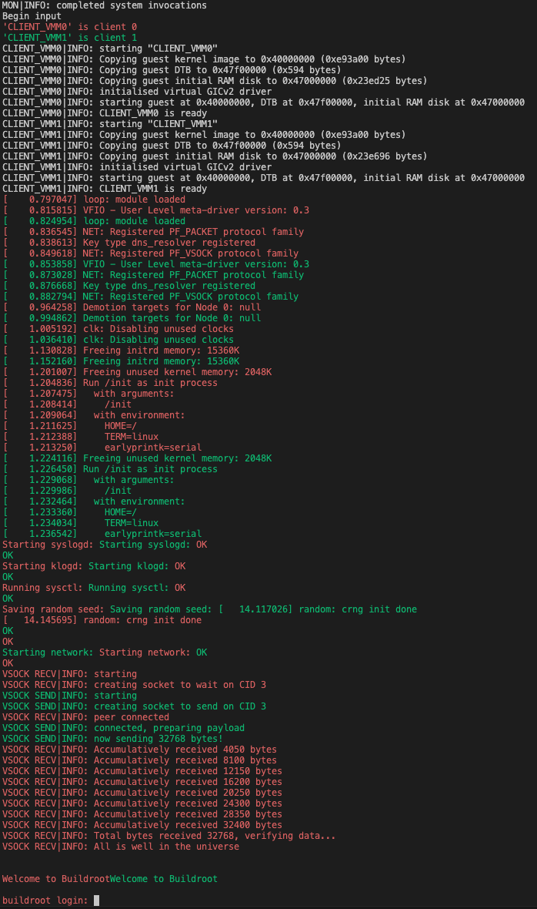

<!--
     Copyright 2025, UNSW
     SPDX-License-Identifier: CC-BY-SA-4.0
-->

# Using multiple virtIO devices with a Linux guest

This example demoes libvmm's VirtIO socket device implementation that allow
inter-guests communication without Ethernet or IP protocols.

We have two Linux VMs, a sender and receiver as follows:
```
--------- VM ---------            --------- VM ---------
Userland:                         Userland:
    vsock_recv.elf                    vsock_send.elf
    ^                                 |
    |                                 v
Kernel:                           Kernel:
    virtio MMIO vsock                 virtio MMIO vsock
    ^                                 |
    |                                 v
--------- VMM --------            --------- VMM --------
virtio vsock device           /-- virtio vsock device
    ^                        /
    |                       /
rx buffer <----------------/      rx buffer
```

In sender VM, `vsock_send.elf` will send 32k worth of data through virtIO socket
to `vsock_recv.elf` in the receiver VM. Then, the receiver VM will verify that the
data are all correct and both programs will quit.

Each virtIO socket device have a small receive buffer that the peer can write to
to send data. The buffer size is advertised to both the sender and receiver via the
`buf_alloc` field of the packet header for the guest driver to split up packets
as necessary.

Here is a demo of that process happening (receiver is red, sender is green):


The example currently works on the following platforms:

* QEMU virt AArch64
* Avnet MaaXBoard
* HardKernel OdroidC4

### Metaprogram

Unlike the other examples, this one uses a metaprogram (`meta.py`) with
the [sdfgen](https://github.com/au-ts/microkit_sdf_gen) tooling to generate the
System Description File (SDF) and other necessary artefacts. Previously,
SDFs were written manually, along with C headers for sDDF-specific configurations,
but this approach was tedious and error-prone. Wit this tooling, we can describe
the system at a higher level, automating the generation of system-specific data.

## Dependencies

In addition to the dependencies outlined in the top-level README, the following
dependencies are needed:
* sdfgen (for generating the System Description File with a metaprogram).

### Linux

<!-- TODO bump sdfgen -->
On apt based Linux distributions run the following commands:
```sh
pip3 install sdfgen==0.23.1
```

If you get error: `externally-managed-environment` when installing via pip, instead run:
```sh
pip3 install --break-system-packages sdfgen==0.23.1
```

### macOS

On macOS, you can install the dependencies via Homebrew:
```sh
pip3 install sdfgen==0.23.1
```

If you get error: `externally-managed-environment` when installing via pip, instead run:
```sh
pip3 install --break-system-packages sdfgen==0.23.1
```

### Nix

The top-level `shell.nix` has everything necessary:
```sh
nix-shell ../../shell.nix
```

## Building

```sh
make MICROKIT_BOARD=<BOARD> MICROKIT_SDK=/path/to/sdk
```

Where `<BOARD>` is one of:
* `qemu_virt_aarch64`
* `maaxboard`
* `odroidc4`

Other configuration options can be passed to the Makefile such as `CONFIG`
and `BUILD_DIR`, see the Makefile for details.

By default the build system fetches the Linux kernel and initrd images from
Trustworthy Systems' website. To use your own images, specify `LINUX` and/or
`INITRD`. For example:

```sh
make MICROKIT_BOARD=qemu_virt_aarch64 MICROKIT_SDK=/path/to/sdk LINUX=/path/to/linux INITRD=/path/to/initrd
```

If you would like to simulate the QEMU board you can run the following command:
```sh
make MICROKIT_BOARD=qemu_virt_aarch64 MICROKIT_SDK=/path/to/sdk qemu
```

This will build the example code as well as run the QEMU command to simulate a
system running the whole system.

## Linux kernel notes
If you decide to BYO kernel, you will need to make sure these configuration
values were set when your kernel was built:
```
CONFIG_VSOCKETS=y
CONFIG_VSOCKETS_LOOPBACK=y
CONFIG_VIRTIO_VSOCKETS=y
CONFIG_VIRTIO_VSOCKETS_COMMON=y
```

It is recommended that you use at least Linux v6.13 as previous versions have an
issue where if you try to send more data than the underlying buffer can accomodate,
the kernel driver won't split up your data and the guests will hang forever waiting
for a transfer that will never take place to complete.

## Hardware set up
Since this example does not touch any real hardware, no setup is necessary.