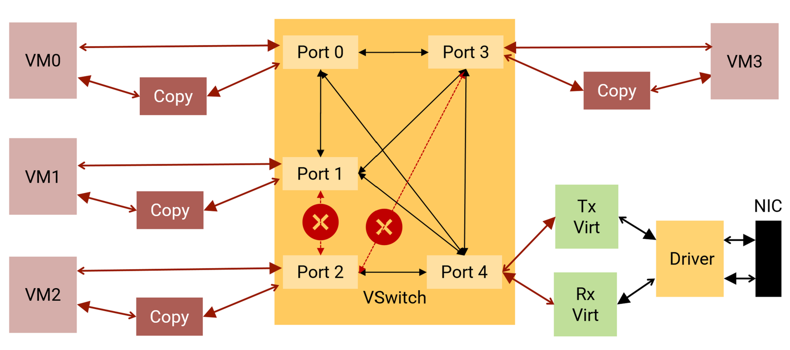
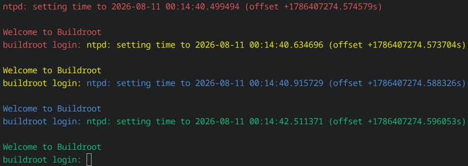
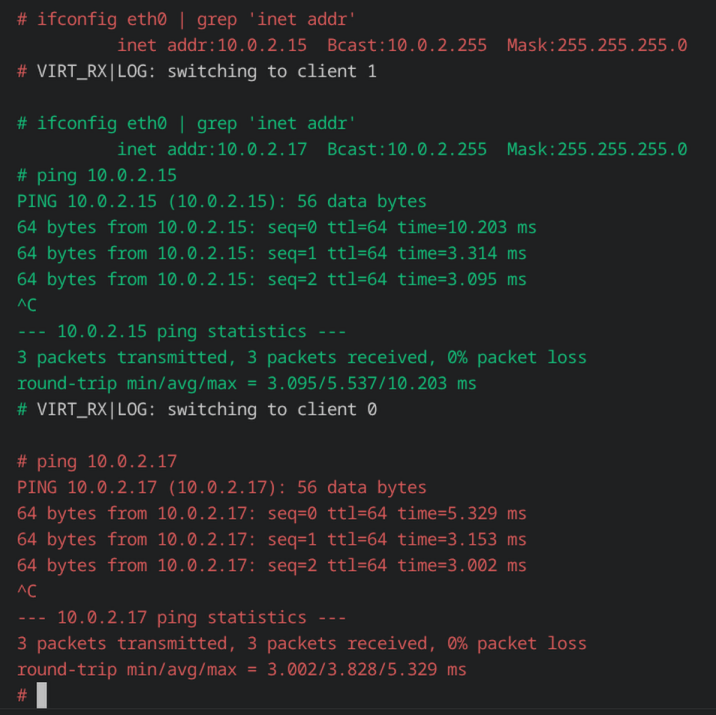
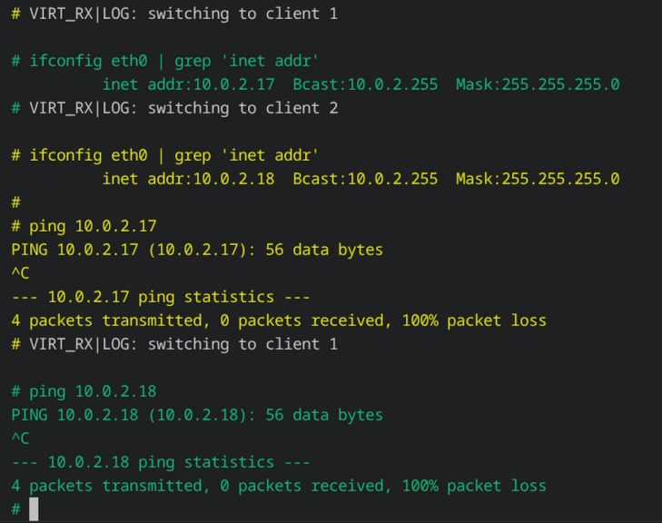

<!--
     Copyright 2026, UNSW
     SPDX-License-Identifier: CC-BY-SA-4.0
-->

# Virtual Network Switch example

This example shows off four VMs on different cores communicating
with each others using a Virtual Network Switch (VSwitch) component
implemented in sDDF. See [this document](../../dep/sddf/docs/network/vswitch.md)
for more details on how the VSwitch works.

Traffic flows in and out of the VMs through the emulated virtIO network
device. The ACL in the metaprogram controls which VM can and can't talk
to another.

This is a high level overview of the system and the ACL rules:



The example currently works on the following platforms:

* QEMU virt AArch64
* Avnet MaaXBoard

### Metaprogram

Unlike the other examples, this one uses a metaprogram (`meta.py`) with
the [sdfgen](https://github.com/au-ts/microkit_sdf_gen) tooling to generate the
System Description File (SDF) and other necessary artefacts. Previously,
SDFs were written manually, along with C headers for sDDF-specific configurations,
but this approach was tedious and error-prone. With this tooling, we can describe
the system at a higher level, automating the generation of system-specific data.

## Dependencies

In addition to the dependencies outlined in the top-level README, the following
dependencies are needed:
* sdfgen (for generating the System Description File with a metaprogram).

### Linux

On apt based Linux distributions run the following commands:
```sh
pip3 install sdfgen==0.36.0
```

If you get error: `externally-managed-environment` when installing via pip, instead run:
```sh
pip3 install --break-system-packages sdfgen==0.36.0
```

This is sound because the `sdfgen` package does not have any dependencies.

### macOS

On macOS, you can install the dependencies via Homebrew:
```sh
pip3 install sdfgen==0.36.0
```

If you get error: `externally-managed-environment` when installing via pip, instead run:
```sh
pip3 install --break-system-packages sdfgen==0.36.0
```

This is sound because the `sdfgen` package does not have any dependencies.

### Nix

There is a Nix flake available in the repository, so you can get a development shell via:
```sh
nix develop
```

Note that this will set the `MICROKIT_SDK` environment variable to the SDK path, you do not
need to download the Microkit SDK manually.

## Building

```sh
make MICROKIT_BOARD=<BOARD> MICROKIT_SDK=/path/to/sdk
```

Where `<BOARD>` is one of:

* `qemu_virt_aarch64`
* `maaxboard`

Other configuration options can be passed to the Makefile such as `MICROKIT_CONFIG`
and `BUILD_DIR`, see the Makefile for details.

By default the build system fetches the Linux kernel and initrd images from
Trustworthy Systems' website. To use your own images, specify `LINUX` and/or
`INITRD`. For example:

```sh
make MICROKIT_BOARD=qemu_virt_aarch64 MICROKIT_SDK=/path/to/sdk LINUX=/path/to/linux INITRD=/path/to/initrd
```

If you would like to simulate the QEMU board you can run the following command:
```sh
make MICROKIT_BOARD=qemu_virt_aarch64 MICROKIT_SDK=/path/to/sdk qemu
```

This will build the example code as well as run the QEMU command to simulate a
system running the whole system.

## Running

When the system boots, the 4 VMMs and their respective VM will start at the
same time, so their outputs will interweave, this is expected. The VMs need
a few seconds to complete their boot process, once you get this output the
system is ready:



Each VM has its own text colour:
- VM 0 is red,
- VM 1 is green,
- VM 2 is yellow,
- VM 3 is blue.

Make a note of the VMs' IP addresses. All VMs can access the internet.

You can switch between them by pressing `Ctrl + \`, then press the number you
want to switch to, and press `Enter`.

The username to login is `root`. There is no password required.

You can now test the VSwitch functionality. For example, VM 0 can ping
VM 1:



But VM 1 can't ping VM 2:


