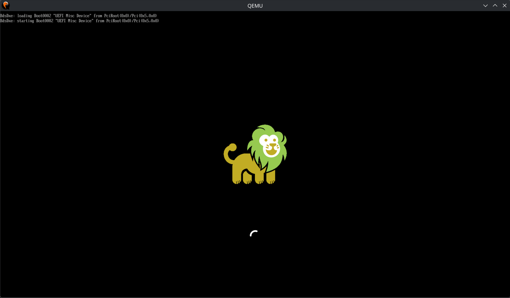

<!--
     Copyright 2026, UNSW
     SPDX-License-Identifier: CC-BY-SA-4.0
-->

# Windows VM example

An example that demonstrates retail Windows 11 booting on libvmm,
with storage, networking and a graphical desktop, under x86_64 QEMU.

## x86_64 Hardware Requirements

You need at least 9 GB of free RAM. QEMU is given 9 GB: 8 GB goes to the Windows
guest, and the remaining 1 GB covers seL4, the VMM, and the other drivers and
components in the system.

QEMU's Tiny Code Generator (TCG) emulates ARM's virtualisation extensions, but
not x86's. To run this example you therefore need:

- an x86_64 Intel CPU with virtualisation (VT-x) enabled in your BIOS,
- a Linux host, and
- KVM enabled.

### Required CPU features

Your CPU must support the following VT-x features, in addition to every feature
required by the Microkit 2.3.0 manual:

- `unrestricted_guest`
- `vtpr`
- `vapic`
- `vapic_reg`
- `vid`
- `preemption_timer`

To check whether your machine has them, grep `/proc/cpuinfo` or run the
`apicv_host_check` script in the `tools` directory.

## Dependencies

In addition to the dependencies listed in the root `README.md`, you need a custom
kernel that enables Intel APICv operation, since APICv is not officially
supported in the kernel. We are preparing an RFC to resolve this. You can either
download a pre-built SDK containing the custom kernel
[here](https://trustworthy.systems/Downloads/libvmm/images/microkit-sdk-2.3.0-apicv.tar.gz),
or build the SDK from source yourself, see `docs/custom_microkit.md` for details.

## Windows 11 install

We cannot distribute a preinstalled Windows 11 disk image, as that would violate
Microsoft's software licence, so you need to create one yourself. You need at
least 65 GB of free disk space for the virtual disk images; more is better,
because the extra space goes to the guest.

### Installation media

First, download the Windows 11 installation ISO from
[Microsoft](https://www.microsoft.com/en-us/software-download/windows11).

1. Scroll down to "Download Windows 11 Disk Image (ISO) for x64 devices".
2. Select "Windows 11 (multi-edition ISO for x64 devices)" from the combo box.
3. Click "Confirm", choose your language, and click "Confirm" again.
4. Click "64-bit Download".

We have tested with `Win11_25H2_EnglishInternational_x64_v2.iso` specifically.

You also need the VirtIO driver package, as the Windows kernel does not ship with
these drivers built in. Download it from the
[virtio-win project](https://github.com/virtio-win/virtio-win-pkg-scripts/blob/master/README.md)
by clicking "Stable virtio-win ISO". We have tested with `virtio-win-0.1.285.iso`
specifically.

Once both images have downloaded, you can start the installation.

### Automation

We have largely automated the Windows 11 installation using Microsoft's
[answer file](https://learn.microsoft.com/en-us/windows-hardware/manufacture/desktop/update-windows-settings-and-scripts-create-your-own-answer-file-sxs?view=windows-11)
mechanism. An answer file is an XML file placed on a disk that the machine can
mount. When the Windows installer boots, it looks for this file and applies the
installation settings it contains.

We generated our `autounattend.xml`, and the ISO holding it, with
<https://schneegans.de/windows/unattend-generator/>. The file:

- bypasses the Secure Boot, TPM and other Windows 11 system requirements, which
  our VMM does not implement;
- installs the VirtIO drivers automatically;
- installs Windows automatically onto a disk of at least 32 GB;
- creates a local account with no password; and
- disables Fast Startup and automatic disk encryption.

### Running the installation

We use QEMU for the installation itself, as this is much faster and more
convenient than running the installer under nested virtualisation on our VMM.

To get started, run:

```shell
$ ./util/offline_install_guest_os.sh <Windows 11 ISO> <VirtIO drivers ISO> <unattend ISO> <disk size GB> <output dir>
```

Point `unattend ISO` at `images/unattend.iso`. `disk size GB` must be at least 32,
but you can increase it as needed; note that the script consumes twice this much
host disk space, because it produces both a raw image and a libvmm image.
`output dir` names the directory that the script creates and writes the final
disk image into.

A QEMU window will open. After a few seconds you will see the prompt "Press any
key to boot from CD or DVD...". Focus the QEMU window and press a key. If you let
the prompt time out, delete the output directory and run the script again.

Once you have pressed a key, the answer file makes the rest of the installation
fully automatic. When you reach the desktop, we recommend letting Windows Update
run and installing any software you need at this point, as doing so is much
faster than under nested virtualisation on libvmm.

When you are finished, shut the VM down cleanly, or the disk image will be
corrupted. Once the guest has shut down, QEMU exits and the script moves on to
its final step: producing an image that libvmm can boot.

That step copies the raw image QEMU created onto the first partition of a
slightly larger image. This reflects the design of the sDDF block subsystem,
where each client is given access to exactly one partition: the VMM sees the
first partition, while the guest sees the contents of the raw image, complete
with its Windows installation.

When the script exits, the image is ready. You will find it in the output
directory as `guest_disk.libvmm`.

### Building and running the VMM

```sh
make MICROKIT_CONFIG=debug MICROKIT_BOARD=x86_64_generic_vtx MICROKIT_SDK=/path/to/sdk GUEST_OS_DISK=/path/to/guest_disk.libvmm qemu
```

This builds the example and runs the QEMU command that simulates the whole
system.

Unless you need debug printing, use the Microkit release
configuration, as it performs best. If you have a hybrid CPU, that is, one with
both "performance" and "efficiency" cores, pin the QEMU process to the
performance cores.

By default the build system fetches the OVMF image from Trustworthy Systems'
website on demand. To use your own image instead, set `OVMF`:

```sh
make MICROKIT_CONFIG=release MICROKIT_BOARD=x86_64_generic_vtx MICROKIT_SDK=/path/to/sdk GUEST_OS_DISK=/path/to/guest_disk.libvmm OVMF=/path/to/OVMF.fd qemu
```

While Windows boot on libvmm, you will see this screen:


Then you will see the desktop.

It is normal for the first boot to take more than 5 minutes as Windows need to reconfigure
its drivers. Subsequent boot should take under 2 minutes.

## QEMU x86_64 troubleshooting

We use native sDDF VirtIO block and network drivers for storage and networking.
These drivers currently rely on hardcoded physical addresses for their device
registers, because sDDF does not yet have merged ACPI and PCI drivers to handle
dynamic mapping. As a result, the drivers crash if your QEMU instance places the
registers at addresses they do not expect. This limitation will disappear once
the ACPI and PCI drivers are merged into sDDF.

The crash looks like this:
```
MON|INFO: Microkit Monitor started!
TIMER DRIVER|ERROR: Invariant TSC not supported, expect performance degradation.
MON|INFO: PD 'timer_driver' is now passive!
BLK DRIVER|ERROR: driver does not support device capacity smaller than 0x1000 bytes (device has capacity of 0x0 bytes)
Failed assertion 'false' at /home/dreamliner7879/TS/libvmm_x86/dep/sddf/drivers/blk/virtio/pci/..//block.c:292 in function virtio_blk_init
MON|ERROR: received message 0x00000003  badge: 0x0000000000000006  tcb cap: 0x000000000000000f
MON|ERROR: faulting PD: blk_driver
Registers:
rip : 0x0000000000204607
rsp : 0x00007fffffffcf90
rflags : 0x0000000000010202
rax : 0x000000000000008b
rbx : 0x0000000000000000
rcx : 0xffffffffffffffff
rdx : 0x000000000000008b
rsi : 0x00007fffffffcf7f
rdi : 0x0000000000000000
rbp : 0x00007fffffffcf90
r8 : 0x0000000000000000
r9 : 0x0000000000000000
r10 : 0x00000000002030d8
r11 : 0x000000000000008b
r12 : 0x0000000000000000
r13 : 0x0000000000000000
r14 : 0x0000000000000000
r15 : 0x0000000000000000
fs_base : 0x0000000000000000
gs_base : 0x0000000000000000
MON|ERROR: UserException
<<seL4(CPU 0) [receiveIPC/153 T0xffffff8001132800 "tcb_monitor" @2001a4]: Reply object already has unexecuted reply!>>
```

If you hit this crash, retrieve the correct physical addresses from QEMU and
update your configuration by hand, as follows.

### 1. Open the QEMU monitor

While QEMU is running, press <kbd>Ctrl</kbd> + <kbd>a</kbd>, in the terminal,
release both keys, then press <kbd>c</kbd>.
You will be dropped at the QEMU monitor prompt:

```
QEMU 11.0.2 monitor - type 'help' for more information
(qemu)
```

### 2. Retrieve the PCI information

At the prompt, type `info pci` to list the connected devices and their memory
allocations. The output will look something like this:

```
(qemu) info pci
  Bus  0, device   0, function 0:
    Host bridge: PCI device 8086:1237
      PCI subsystem 1af4:1100
      id ""
  Bus  0, device   1, function 0:
    ISA bridge: PCI device 8086:7000
      PCI subsystem 1af4:1100
      id ""
  Bus  0, device   1, function 1:
    IDE controller: PCI device 8086:7010
      PCI subsystem 1af4:1100
      BAR4: I/O at 0xc0a0 [0xc0af]
      id ""
  Bus  0, device   1, function 3:
    Bridge: PCI device 8086:7113
      PCI subsystem 1af4:1100
      IRQ 9, pin A
      id ""
  Bus  0, device   2, function 0:
    Ethernet controller: PCI device 1af4:1000
      PCI subsystem 1af4:0001
      IRQ 10, pin A
      BAR0: I/O at 0xc080 [0xc09f]
      BAR1: 32 bit memory at 0xfebc8000 [0xfebc8fff]
      BAR4: 64 bit prefetchable memory at 0xe0000000000 [0xe0000003fff]
      BAR6: 32 bit memory (not mapped)
      id ""
  Bus  0, device   3, function 0:
    SCSI controller: PCI device 1af4:1001
      PCI subsystem 1af4:0002
      IRQ 11, pin A
      BAR0: I/O at 0xc000 [0xc07f]
      BAR1: 32 bit memory at 0xfebc9000 [0xfebc9fff]
      BAR4: 64 bit prefetchable memory at 0xe0000004000 [0xe0000007fff]
      id ""
  Bus  0, device   4, function 0:
    Display controller: PCI device 1234:1111
      PCI subsystem 1af4:1100
      BAR0: 32 bit prefetchable memory at 0xfd000000 [0xfdffffff]
      BAR2: 32 bit memory at 0xfebca000 [0xfebcafff]
      BAR6: 32 bit memory (not mapped)
      id ""
(qemu)
```

### 3. Update `meta.py`

In the Ethernet controller and SCSI controller entries, find the line reading
`BAR4: 64 bit prefetchable memory at ...`. Replace `VIRTIO_NET_PCI_BAR_PADDR` and
`VIRTIO_BLK_PCI_BAR_PADDR` with the addresses your QEMU instance allocated. Check
that `VIRTIO_NET_PCI_IRQ` and `VIRTIO_BLK_PCI_IRQ` match the output too.

Then, in the display controller entry, find the lines reading
`BAR0: 32 bit prefetchable memory at ...` and `BAR2: 32 bit memory at ...`. BAR0
is the framebuffer and BAR2 is the video registers, so replace
`BOCHS_DISPLAY_FB_BAR_PADDR` with BAR0 and `BOCHS_DISPLAY_REGS_BAR_PADDR` with
BAR2.