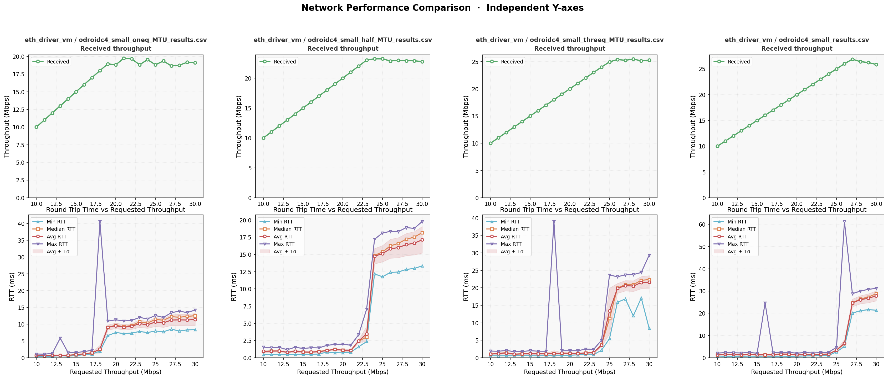
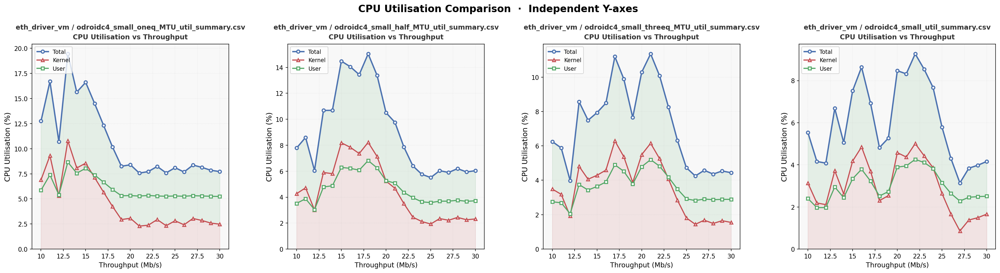

# What is this testing
I am testing the ethernet VM implementation for the odroidc4 vs native and linux (which I am yet to benchmark but have results from LionOS paper)

# Initial results
My initial testing of the libvmm setup with a passthrough linux NIC driver showed poor results compared to the native seL4 and linux (I have not conducted testing but drawing from the LionOS paper) implmentations. As shown in the right most panel of Figure 1 (Maximum size MTU), the throughput caps at ~26Mbp/s, far below the 1Gbp/s capabilities of the NIC. However, unlike the saturation of linux in Figure 2 which corresponds to the CPU utilisation hitting 100%, The right most panel of Figure 3 shows the low utilisation during saturation.

I should get the numbers for just the VM, as maybe its budget is causing issues.

![Figure 2: LionOS seL4 vs linux]

# Hypothesis
The lack of correlation between CPU utilisation and throughput saturation indicates significant stalling. Thus, I should focus on 

Ethernet specific
- Blocking syscall within the linux VM implementation

Architectural
- Latency in delievering interrupts to or from the VM

# Further testing
Given the issue seems to be related to timing I wanted to know if it was related to th number of bytes or the number of packets. Thus, I completed a sweep across 4 MTU sizes (1/4, 1/2, 3/4, 1 of the maximum MTU size)

To verify with Peter. Does IPbench include headers in its throughput calculations? I am assuming yes

Given the increased header to payload of smaller MTU we should see some performance degredation?

Full 1472 UDP packet overhead = 28 / 1500 = 1.89
3/4 1104 = 28 / 1138 = 2.5
1/2 736 = 28 / 764 = 3.7
1/4 368 = 28 / 396 = 7.1

The number of packets to saturate (assuming header is included)
Full = 18682 (18333)
3/4 = 22645 (21968)
1/2 = 30571 (29450)
1/4 = 50272 (46717)

So it doesn't look like the saturation is directly related to the number of packets

# MTU sweep
The results show the saturation occurs at 18, 22.5, 25, 27.5 respectively. That is a 9%, 19%, 35% degredation

The RTT also jumps at the same point increasing to 10, 15, 22.5, 27.5ms. 

*Thus, the increase in RTT seems correlated to the size of the packet* 

More packets means more overhead, but it seems that the degredation is higher than just the extra bytes. 

*What is the common factor in saturation*

# Where to go from here?
I could go further into investigating this. I can also get the maaxboard branch working and test that. I could also consider the client case by running the mibench suite on linux and a vm. I could also test the complete linux vm case with a nic and client inside a vm.

